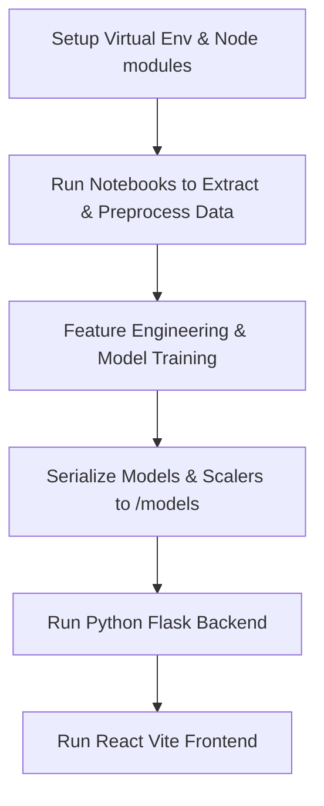

# Builder Flow

This document outlines the workflow for developers and model builders to set up, run, train, and modify the **AI Market Direction** application.



---

## 1. Environment Setup

### Backend Prerequisites
The backend uses a Python 3.11 virtual environment.
1. Navigate to the root directory.
2. Initialize or activate the virtual environment:
   ```powershell
   # Windows PowerShell
   .\venv\Scripts\activate
   ```
3. Install the required dependencies:
   ```bash
   pip install -r backend/requirements.txt
   ```
   *Note: Ensure `scikit-learn==1.9.0` and `numpy==2.4.6` are installed to support correct model deserialization.*

### Frontend Prerequisites
The frontend is built using React 19 and Vite.
1. Navigate to the `frontend/` directory:
   ```bash
   cd frontend
   ```
2. Install npm modules:
   ```bash
   npm install
   ```

---

## 2. Notebook Execution & Model Building
Before the API server can run predictions, you must collect, process, and train the machine learning models. Under the `notebooks/` directory, run the Jupyter notebooks in numerical order:

1. **`01_Data_Collection.ipynb`**: Fetches historical market data (`^NSEI`, `GC=F`, `CL=F`, `INR=X`, `^INDIAVIX`) via the Yahoo Finance API (`yfinance`). Saves raw CSV files to `data/raw/`.
2. **`02_Data_Preprocessing.ipynb`**: Performs data cleaning, handles missing market hours, aligns dates, merges raw datasets, and outputs `processed_data.csv` to `data/processed/`.
3. **`03_Feature_Engineering.ipynb`**: Computes technical indicators (SMA, EMA, RSI, MACD, Bollinger Bands) and macro features. Outputs `feature_engineered_data.csv`.
4. **`04_Model_Training.ipynb`**: Validates features, scales inputs with `StandardScaler`, trains the Logistic Regression, Random Forest, and Gradient Boosting models, and saves the binary classifiers (`.pkl` format) and scaler to the `models/` directory using `joblib`.
5. **`05_Model_Evaluation.ipynb`**: Loads the trained classifiers, generates validation reports, computes evaluation metrics, and compiles performance data.

---

## 3. Running the Application

### Launching the Backend Server
From the root directory, run the Flask backend:
```powershell
.\venv\Scripts\python.exe backend/app.py
```
This runs the API server locally at `http://127.0.0.1:5000/`.

### Launching the Frontend Server
From the `frontend/` directory, launch the Vite development server:
```bash
npm run dev
```
This serves the UI at `http://localhost:5173/`.
