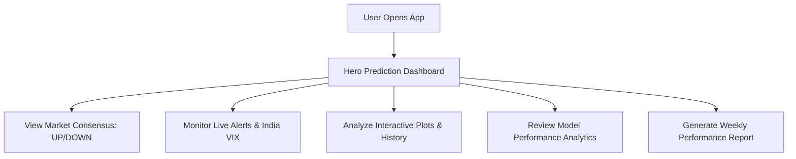

# User Flow

This document details the step-by-step experience of an end-user interacting with the **AI Market Direction Dashboard**. The application provides stock market predictions (NIFTY 50) using machine learning ensemble methods.

---

## 1. Landing & Main Dashboard
When the user visits `http://localhost:5173/`, they are greeted by a premium dark-themed dashboard.
- **Hero Prediction Card**: Highlights the primary forecast for the next trading day (e.g., **UP** or **DOWN**), accompanied by an overall ensemble **Confidence Score (0-100%)**.
- **Consensus Breakdown**: Displays individual probabilities calculated by three independent machine learning algorithms:
  * Logistic Regression
  * Random Forest
  * Gradient Boosting
- **Live Price Tracker**: Displays the simulated current price of NIFTY 50 with real-time micro-fluctuations, percentage change, and the exact timestamp of the last update.

---

## 2. Alerts & Market Sentiment Panel
On the dashboard, the user can monitor system-generated real-time market signals:
- **Ensemble Signals**: Highlights high-confidence signals when all models agree, or flags warning messages when model divergence is high.
- **India VIX Volatility Gauge**: Visualizes market fear levels. Low VIX indicates calm bullish conditions, while a high VIX alerts the user to manage risks or downsize positions.
- **Macro-Economic Warnings**: Shows upcoming macro events (such as RBI monetary policy announcements) and their predicted historical impact on volatility.

---

## 3. Interactive Charts & Timeline
Users can navigate or scroll down to explore visual trends:
- **Historical Analysis**: View NIFTY 50 historical price actions alongside model predictions to check retrospective forecasting accuracy.
- **Intraday Forecast Timeline**: Provides segmented prediction intervals throughout the trading session (e.g., Opening, Mid-session, Closing).
- **Macro Indicators**: Compare index movements with safe-haven assets (Gold), energy commodities (Crude Oil), and forex rates (USD/INR).

---

## 4. Analytics & Weekly Report Card
For users who require performance metrics:
- **Accuracy Overview**: Displays the validation performance of each individual model.
- **Weekly Report Generator**: Downloads or prints a summarized PDF/HTML sheet showing the weekly prediction accuracy, true positives/negatives, and performance metrics of the best-performing model.
